# Traffic Volume Prediction

Sheldon Sebastian

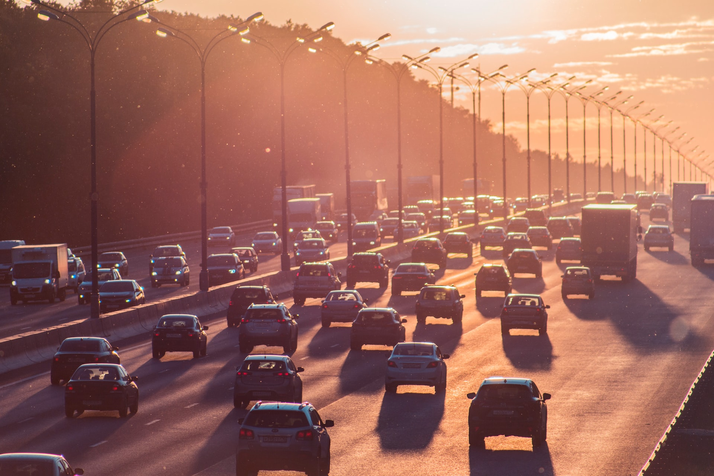

Photo by <a href="https://unsplash.com/@5tep5?utm_source=unsplash&utm_medium=referral&utm_content=creditCopyText">Alexander Popov</a> on <a href="https://unsplash.com/s/photos/traffic?utm_source=unsplash&utm_medium=referral&utm_content=creditCopyText">Unsplash</a>

  

## Abstract

 
We are predicting the traffic volume per day for the I94 interstate. The traffic volume per day is the number of cars which use the I94 interstate between St. Paul and Minneapolis. To make accurate forecasts, 6 models Average Model, Naïve Model, Drift Model, Holt Winter Model, Multiple linear regression and ARMA were used. The performance of the all models are compared and the best performing model is recommended to forecast traffic volume.
 
 
<i>Keywords:</i> Forecasting, Traffic, Average model, Naïve model, Drift Model, Holt Winter, ARMA, Linear Regression

## Table of contents

1. Introduction
2. Data description
3. Stationarity check
4. Average Model
5. Naive Model
6. Drift Model
7. Time series decomposition
8. Holt Winters method
9. Multiple Linear Regression
10. ARMA model
11. Best Model
12. Conclusion

## Dataset

For our project we used the MaskedFace-Net dataset[1]. This dataset is a synthetic dataset created
using Generative Adversarial Network (GAN) on the Flickr-Faces-HQ Dataset[2]. The
MaskedFace-Net model created synthetic images of people wearing the mask correctly and
incorrectly. For our project we also wanted to identify whether the person was wearing a mask or
not. So we added the original Flickr-Faces-HQ dataset images of people not wearing a mask to
achieve this task.
  
The data was downloaded using CURL command and the python scripts are available in the Data
Download Scripts Folder of the Github repository. The final combined dataset contains 60,000
images and is 15 GB in size.
  
Of the 60,000 images 20,000 images were of incorrect worn masks, 20,000 images were of
correct worn masks and 20,000 images were of uncovered faces.
  
80% of the dataset was used for training and 20% was used as holdout or test set. The script to
split into train-validation and holdout is found in DataPreprocessing.py. 
  
The data was organized such that it was accessible using the ImageFolder API of Pytorch.

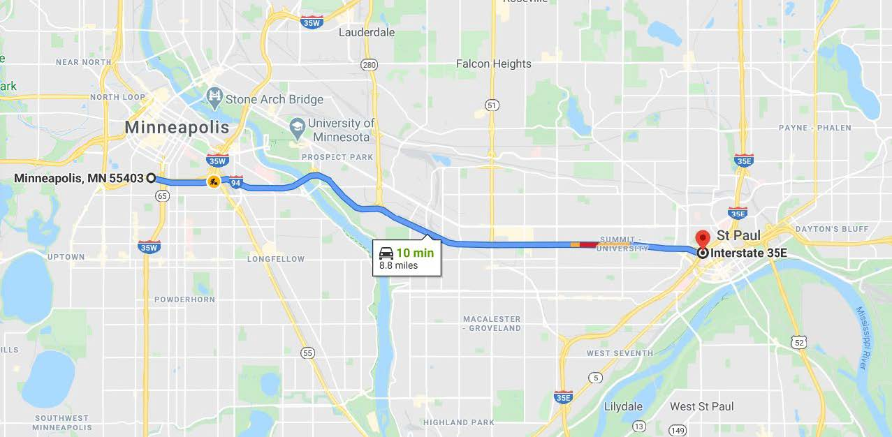

And inside each folder of holdout(test), train, and validation we have following folders:

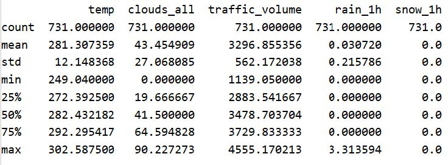

The dataset contains the following 3 image labels:

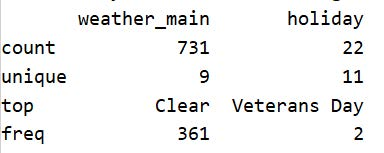

## Network and Training

For the purposes of this project we are planning to use Convolutional Neural Networks, in its
standard form. We explored pre-trained models - Resnet18, Resnet50, Alexnet, VGG, Densenet
and Inception. We trained all of these models for 20 epochs with standard hyperparameters and
then then selected the one that gave us highest validation accuracy for further enhancements.
 
 
ResNet50 gave us the highest validation accuracy of about 88% without any tuning and hence was
selected for this project. ResNet50 is a 50 layer Residual Network. ResNet , short for Residual
Networks, is a classic neural network used for many computer vision tasks. This model was the
winner of the ImageNet challenge in 2015. The fundamental breakthrough with ResNet was it
allows training of extremely deep neural networks with 150+layers. Prior to ResNet training very
deep neural networks were difficult due to the problem of vanishing gradients.

## Experimental Setup

We selected ResNet50 because of the reasons mentioned above. The data was fed into the
network with the following train, test and validation splits - 80:20 train and test, the validation was
20% of the train. The network was then fine tuned to increase accuracy. Since the dataset was
balanced we did not need too many augmentations.
 
 
<i>Transformations</i>
 
Resize instead of RandomResizedCrop for train data - We used the pre-processing resize
transform instead of the augmentation random resized crop because our data consisted of images
which contain human faces in the entire frame in most cases, so our object of interest is within the
frame.
 
ColorJitter Transformation - We used the ColorJitter transformation on the training data which
randomly changes the color saturation of images to any percentage between zero and hundred.
This helps in generalizing better masks of different colors.
 
We tried a few other augmentations like flipping images but since the data was balanced those
augmentations only worsened accuracy.
 
 
<i>Hyperparameters</i> 
Learning Rate - Learning rate of 0.001 was used for this model. We tried 0.0001 as well but that
worsened the accuracy metrics.
 
Batch Size - Batch size of 512 was used. In some cases if the cuda ran out of memory we reduced
the batch size to 256 or 128 to run the model.
 
Optimizer - Adam was used as the optimizer.
 
Epochs - The model was run for 10 epochs.
 
 
<i>Regularization</i>
 
Regularizing with Dropout - We have used 30% dropout rate in our model to prevent overfitting.
We tried using 20% but 30% gives us the optimum results.
 
 
<i>Model Accuracy</i>
 
The performance of the model was judged based on accuracy and loss values for train, validation
and holdout set. The loss on train and validation sets for ten epochs is given below -
 

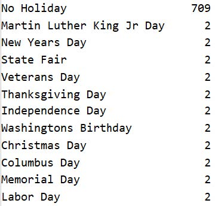

The model does well since both train and validation loss are moving in the same direction for ten
epochs and the validation loss decreases throughout the training.
 
Since the dataset was balanced, we have used accuracy as a metric to evaluate the model. The F1
score is using the option average=’micro’ and since the dataset is balanced, it is equal to the
accuracy. The results for the final model are given below -
 

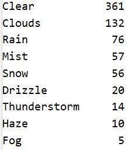

## Model Interpretation

Once the model was trained with strong validation accuracy and low validation loss, we
interpreted the CNN model on the training dataset using Occlusion experiment[3].
  
Occlusion experiments are performed to determine which <b>patches of the image</b> contribute
maximally to the output of the neural network.
  
In the occlusion experiment, we iterate over all the regions of the image systematically by
occluding(blocking) a part of the image with a grey patch and monitor the probability of the
classifier using a heatmap.

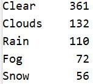

After blending the probability heatmap and the original image we get the following output:
 

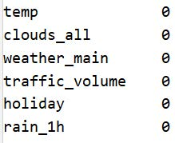

After blending the probability heatmap and the original image we get the following output:
We notice that we get low probability for the classifier when the patches of images containing
nose or upper mouth are occluded. Thus, the occlusion experiment tells us that the CNN model is
learning relevant patterns in the image.
  
For other image labels the occlusion experiment results are as follows:

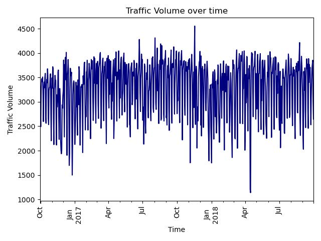

From above results we can conclude that the model is identifying relevant features to make
classification predictions.

## Results

To understand how well the model performs and make predictions on real world face images, we
performed an inference for classification on images captured with a camera, with different
samples of face images: without a face mask, with a face mask and with an incorrectly worn face
mask.
  
A predict function was written that takes a processed image and returns the top k most likely
classes along with their probabilities. The block diagram for this procedure is shown below:

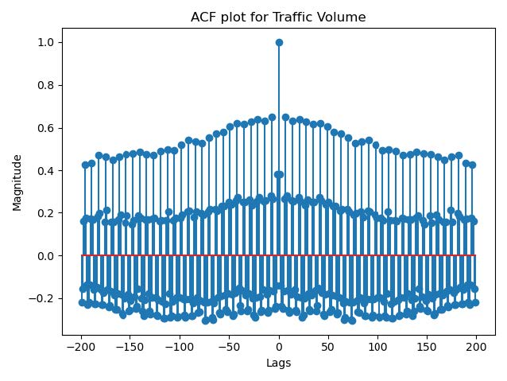

  

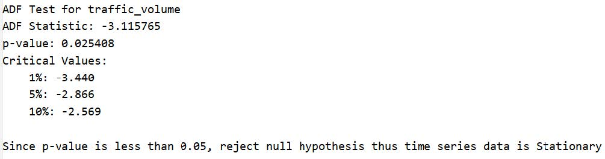

Figure 6.1 Face mask prediction with face image covered

We observed for an image with a face mask, the model gave a correct prediction with a
probability of about 0.7. Other predictions were made with the model with the results shown
below:

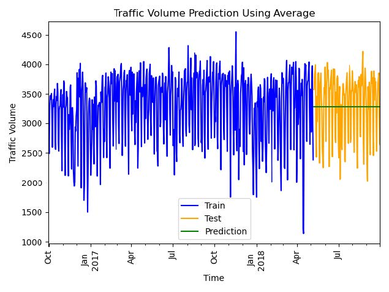

Figure 6.2 Face mask prediction with face image uncovered, incorrect and covered

We observed for an image without a face mask, the model gave a correct prediction with a
probability of 1.0, while the prediction with an incorrectly worn face mask gave a correction
prediction with a probability of about 0.75. We tested the model with a different color of face
mask (white) to observe if there was any significant difference in the prediction with the black face
mask used earlier, The model gave a reduced probability of about 0.6 with a correct prediction of
a covered facemask.

We investigated further by cropping the image to reveal the face of the person only. The result of
the prediction is shown below:

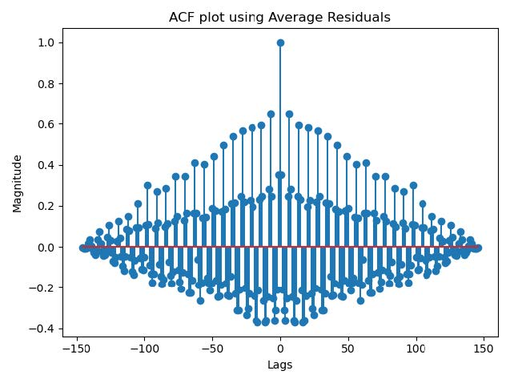

Figure 6.3 Face mask prediction with cropped face image

The model produced a correct prediction for a covered face mask with a probability of
approximately 0.95, an improvement on previously classification results.

## Summary and Conclusion

From the results, we conclude that the model performs better when the input image is processed
to reveal the face only. This is because the model was trained to make classification based on face
mask coverings as we observed in the occlusion experiment. From figure 6.3 a cropped face image
produced a correct prediction with a probability of approximately 0.95, which is consistent with
accuracy of <b>0.9522</b> obtained for the held-out dataset. In figures 6.1 and 6.2, other features, like the
surrounding environment and the body of the human, contributed to the features fed to the model
which reduced the prediction performance.
Further work will require the development of a primary model to detect faces in an image, before
applying the face mask model developed in this project. The primary model should be able to
predict a bounding box around the face for detection. The face can then be fed to the face mask
detector model for classification.

## References

1. Link to all code files: https://github.com/sheldonsebastian/Traffic_Prediction_Using_Time_Series
 

