# Traffic Volume Prediction

Sheldon Sebastian

Photo by <a href="https://unsplash.com/@5tep5?utm_source=unsplash&utm_medium=referral&utm_content=creditCopyText">Alexander Popov</a> on <a href="https://unsplash.com/s/photos/traffic?utm_source=unsplash&utm_medium=referral&utm_content=creditCopyText">Unsplash</a>

  

## Abstract

 
We are predicting the traffic volume per day for the I94 interstate. The traffic volume per day is the number of cars which use the I94 interstate between St. Paul and Minneapolis. To make accurate forecasts, 6 models Average Model, Naïve Model, Drift Model, Holt Winter Model, Multiple linear regression and ARMA were used. The performance of the all models are compared and the best performing model is recommended to forecast traffic volume.
 
 
<i>Keywords:</i> Forecasting, Traffic, Average model, Naïve model, Drift Model, Holt Winter, ARMA, Linear Regression

## Table of contents

1. Introduction
2. Data description and preprocessing
3. Stationarity check
4. Average Model
5. Naive Model
6. Drift Model
7. Time series decomposition
8. Holt Winters method
9. Multiple Linear Regression
10. ARMA model
11. Final Model Selection
12. Conclusion

## 1. Introduction

We are predicting the number of cars in a day on the I94 interstate between St. Paul and Minneapolis as shown in the below figure:

 

Business value of project:
 
<ol>
<li>Avoid Traffic Congestion: We can predict the days when there will be heavy traffic congestion and thus take contingencies to avoid them.</li>
<li>Road Maintenance: Using the traffic volume predictions we can estimate how long before the road needs repairs and we can schedule repairs when there is least traffic volume.</li>
</ol>
For achieving the goal of predicting traffic volume, we are considering 6 prediction models: Average, Naïve, Drift, Holt Winter, ARMA model and Multiple Linear Regression model.  
In average model, all the future predictions are average of the training data. In naïve model, we predict all the future values by taking the last value of the training dataset. In drift model, we plot a line from the first point of the data to the last point and extend it to predict all the future values. In the Holt Winter method, we will find whether traffic volume follows additive or multiplicative trend and then make predictions.
For the Linear Regression Model, we will scale the feature variables and perform data cleaning and then make predictions. Finally, for ARMA model, we will estimate the order of the ARMA process using GPAC table, estimate the parameters for ARMA and check whether the residuals pass the chi square test or not.  
Once all the models are created, we will compare the performance and recommend the best performing model.

## 2. Data description and preprocessing

The dataset has hourly traffic volume from October 2012 to September 2018. Traffic volume is defined as count of cars in an hour on the interstate. As described previously, the hourly traffic volume is tracked between Minneapolis and St Paul, MN.

  
The dataset is sourced from the following website: 
https://archive.ics.uci.edu/ml/datasets/Metro+Interstate+Traffic+Volume

 
<b>Resampling strategy</b>
 

For computational purposes and model interpretability the hourly data was resampled into daily data. Also, we are focusing on traffic volume data for September 2016 to September 2018.

When we perform resampling the following functions were applied to the variables:
<ul>
<li>Mean: temp, clouds_all, traffic_volume, rain_1h, snow_1h.</li>
<li>First: weather_main, holiday.</li>
</ul>

After resampling the shape of the dataset is <b>(731,7)</b>.

 
<b>Summary Statistics</b>
 

The summary statistics for numeric columns are as follows: 

We notice that the snow_1h column has all values as zero, thus we remove that column.
  
The summary statistics for categorical columns are as follows: 

We notice that the holiday column has 22 values only, thus we replace all the other NaN values with “No Holiday” values. After replacing all the holiday NaN columns with 'No Holiday' value we get value counts for holiday column as:
 

 
We also notice that the weather_main column contains 9 unique values which are:
 

 
We condense this information as follows:
<ul>
<li>Rain additionally covers the values Drizzle, Thunderstorm</li>
<li>Fog additionally covers the values Mist, Haze, Smoke</li>
</ul>
 
Thus, after condensing the value counts are as follows:
 

 
Finally, after resampling and data cleaning the column count with NaN values are:
 

 
Hence, we do not need to perform any data imputation.

 
<b>Traffic Volume over time</b>
 

We plot the traffic volume over time, the traffic volume data is resampled to daily data and the scope of data is from 09/2016 to 09/2018.

 
<b>ACF of traffic volume</b>
 

For plotting the ACF plot we have set the value of lag = 200.

 
We notice that the ACF values show decay at lag = 200.

 
<b>Train-Test Split</b>
 

We split the resampled data into train and test datasets. The dimension for train dataset is <b>(584,6)</b>. The dimension for test dataset is <b>(147,6)</b>

## 3. Stationarity check

To check if traffic volume is stationary or not, we perform the ADF test.
 

 
From ADF test we conclude that traffic volume is stationary.

## 4. Average Model

We compute the mean of training data and perform h step predictions to match the size of the test data.

 
The model statistics are as follows: 
<table>
<tr>
<th>RMSE</th>
<th>MSE</th>
<th>Residual Variance</th>
<th>Residual Mean</th>
</tr>
<tr>
<td>531.918</td>
<td>282937.565</td>
<td>279859.840</td>
<td>55.477</td>
</tr>
</table>

 
The plot of forecasted values with the actual value is shown below:

  
The ACF of residuals is as follows:

 
We conclude that the ACF plot does not resemble white noise.

## 5. Naive Model

We find the last sample of training data and perform h step predictions to match the size of the test data.

 
The model statistics are as follows: 
<table>
<tr>
<th>RMSE</th>
<th>MSE</th>
<th>Residual Variance</th>
<th>Residual Mean</th>
</tr>
<tr>
<td>1091.679</td>
<td>1191763.077</td>
<td>279859.840</td>
<td>954.936</td>
</tr>
</table>

 
The plot of forecasted values with the actual value is shown below:

  
The ACF of residuals is as follows:

 
We conclude that the ACF plot does not resemble white noise.

## 6. Drift Model

The performance measures for the Drift Model are as follows:

<table>
<tr>
<th>RMSE</th>
<th>MSE</th>
<th>Residual Variance</th>
<th>Residual Mean</th>
</tr>
<tr>
<td>1223.722</td>
<td>1497497.754</td>
<td>284349.208</td>
<td>1101.430</td>
</tr>
</table>

 
The plot of forecasted values with the actual value is shown below:

  
The ACF of residuals is as follows:

 
We conclude that the ACF plot does not resemble white noise.

## 7. Time series decomposition

We will decompose traffic volume to comprehend whether trend and seasonality are additive or multiplicative. 
The Multiplicative time series decomposition plot is shown below:

 The Additive time series decomposition plot is shown below: 

We notice that the additive residuals have high variance and it ranges from +1000 to -1000, whereas all the multiplicative residuals are close to one.  
Thus, the multiplicative decomposition best represents the traffic volume data and we see a strong seasonality component but there is no trend visible.

## 8. Holt Winters method

Based on the time series decomposition we will configure the Holt-Winters parameters for predicting the test data. We will set the seasonality to be multiplicative and set trend to be None.

The performance measures for the Holt Winters Model are as follows:

<table>
<tr>
<th>RMSE</th>
<th>MSE</th>
<th>Residual Variance</th>
<th>Residual Mean</th>
</tr>
<tr>
<td>291.017</td>
<td>84690.827</td>
<td>84197.577</td>
<td>-22.209</td>
</tr>
</table>
 
The plot for Holt Winter model prediction along with actual predictions is shown below:
 

 
We notice from above plot that the Holt Winter model predictions are close to the actual values.
  
ACF of residuals: We notice that the ACF plot for Holt Winter method resembles the white noise.

## 9. Multiple Linear Regression

### Linear Model with all Features:

We will now perform multiple linear regression and for this we need to scale the data and convert the categorical columns into numerical columns.
  
We scale the feature variables using sklearn.preprocessing’s MinMaxScaler function and then compute the MSE values for the test data and the predicted values.
  
We convert the categorical values into numerical values by using pandas get_dummies(…) function.

 
The summary of linear model with all variables is:

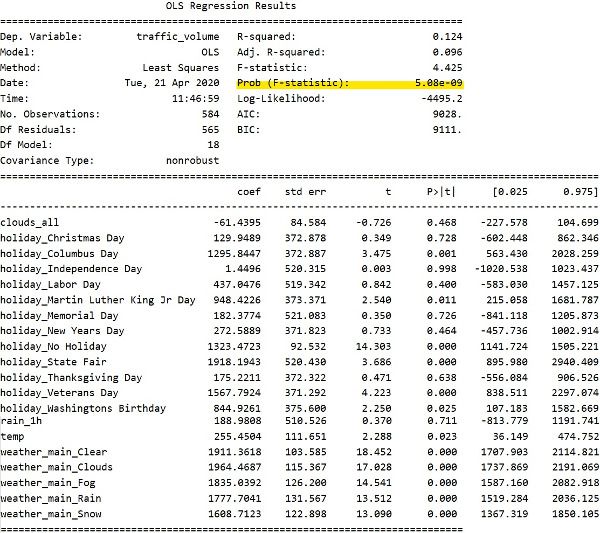

 
Conclusions based on above summary: 
F-test : The F-test passes since the Prob(F-statistics) is less than 0.05 and thus our model performs better than null model. 
AIC: The AIC value is 9028 
BIC: The BIC value is 9111 
T-test: There are variables which fail the t-test, to fix this we drop the variables which fail the t-test.
 

### Linear Model after Feature Selection:

Since there are variables which fail the t-test when we use all variables model, we remove these variables and repeat the linear model process until all the variables pass the t-test.

The summary of linear model after feature selection is:

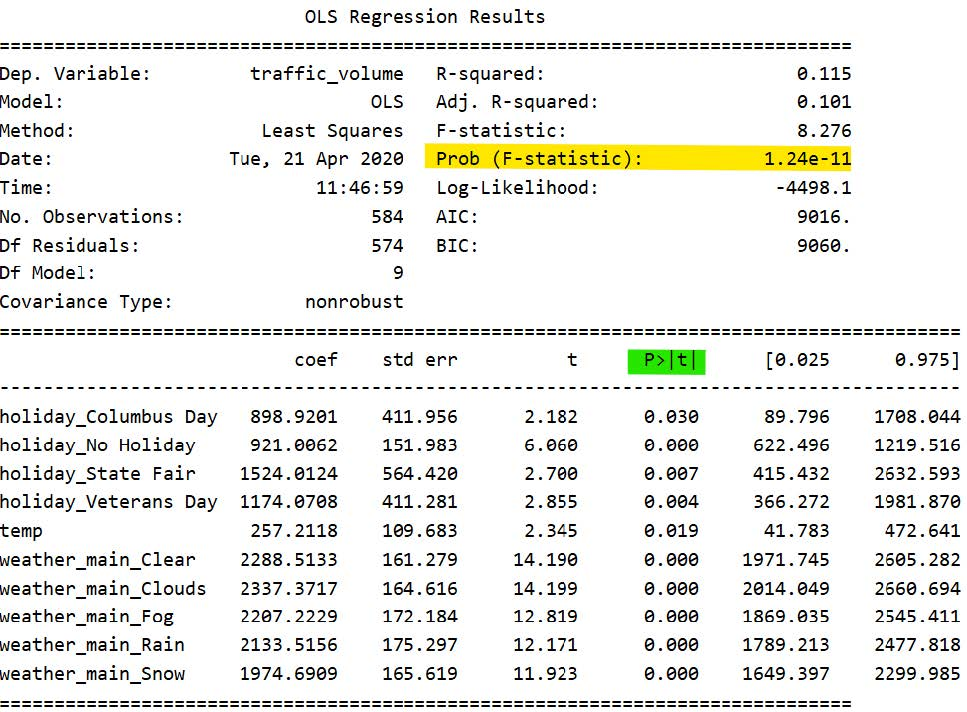

 
Conclusions based on above model: 

F-test: The Prob(F-statistics) < 0.05 thus our model performs better than the null model and it passes the F-test. 
AIC: The AIC value is 9016 which is lower than all variables model. 
BIC: The BIC value is 9060 which is lower than all variables model. 
T-test: The t-test passes for all variables since the P(t) < 0.05 for all variables. 
R-Squared: The R-squared value is 0.115 
Adjusted R-squared: The adjusted R-squared value is 0.101 which is better than all variables model.  

The performance measures for the Linear Model after feature selection are as follows:

<table>
<tr>
<th>RMSE</th>
<th>MSE</th>
<th>Residual Variance</th>
<th>Residual Mean</th>
</tr>
<tr>
<td>506.384</td>
<td>256424.508</td>
<td>255166.372</td>
<td>-35.470</td>
</tr>
</table>
 

ACF of residuals: 
We observe the residuals are decaying in ACF plot, but they do not resemble a white noise.

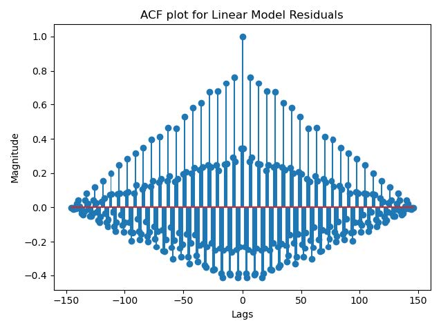

 
The Q value of residuals of Linear Model is: 1333.365
  

<b>Correlation Coefficient Matrix:</b> 
The correlation coefficient matrix includes only those variables which have been used for final linear model. After feature selection the final independent features are: 
holiday_Columbus Day, holiday_No Holiday, holiday_State Fair, holiday_Veterans Day, temp, weather_main_Clear, weather_main_Clouds, weather_main_Fog, weather_main_Rain, and weather_main_Snow.
  

We notice there is no strong relationship between the variables and thus no multicollinearity is present. The correlation coefficient matrix is as follows: 

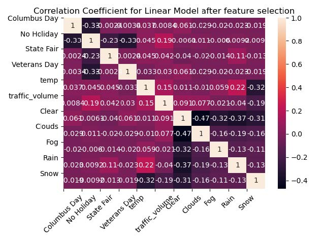

 
The plot for linear model prediction along with actual predictions is shown below:
 

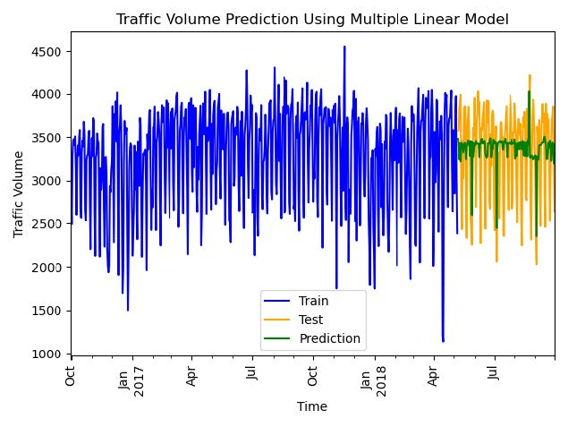

## 10. ARMA model

We will now predict the test data using the ARMA process. For this we will create the GPAC table and then find potential order of the ARMA process. After we find the order of ARMA process we will estimate its parameters.  
We computed the mean of training data and subtracted it from the training data. This is done to relax the ARMA constraint. Since the ARMA model does not include an intercept, it might be a challenge to fit data with non-zero mean.  
Once the order and parameters are estimated we will forecast the values and add the mean of training data. After adding mean, we check whether the residuals of forecasted and actual values are significant or not using the chi squared diagnostic test.

### GPAC Table:

The GPAC table with j=12, and k=12 is shown below:

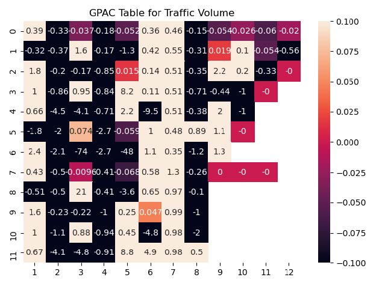

 
From the GPAC table we consider the following orders for ARMA parameter estimation.

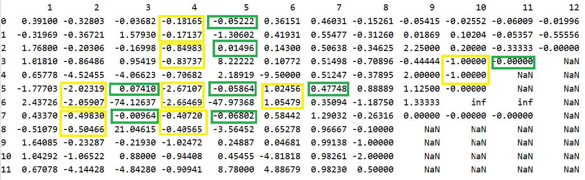

 

(n_a, n_b) = [(2, 5), (2, 7), (4, 0), (4, 2), (4, 5), (4, 7), (6, 5), (10, 3)]  
We noticed that none of the identified ARMA order from the GPAC table pass the chi squared test.  
Thus, we try for all possible combinations of orders from the GPAC table in a brute force manner; the ARMA(4,6) passes the Chi Square test, but shows no pattern in GPAC table; this might be possible since we have only 584 samples in the training data.

### Chi Square Test:

After trying a brute force approach for all possible order combinations for GPAC table, the ARMA(4,6) passes the chi square test. And as mentioned previously it shows no pattern in the GPAC table, a possible reason could be the small training size of 584 data points.

### Parameter Estimation:

The estimated parameters based on n_a=4 and n_b=6 is: 

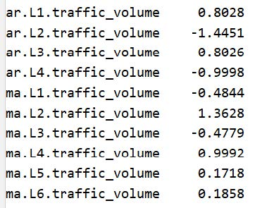

### Summary of ARMA(4,6) model:

The summary of ARMA(4,6) model is as follows: 

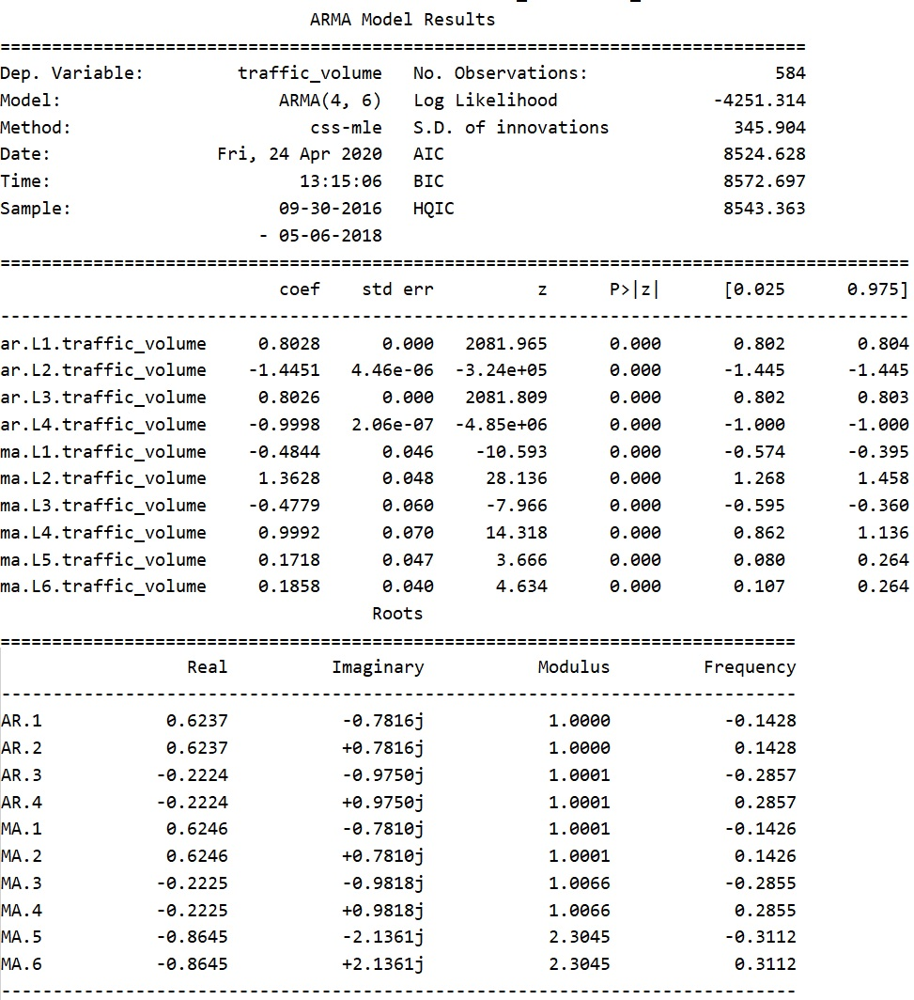

### Simplification of Model:

We will now simplify the ARMA(4,6) model by checking if zeros are included in confidence interval or not. 
The confidence interval for the parameters are as follows: 

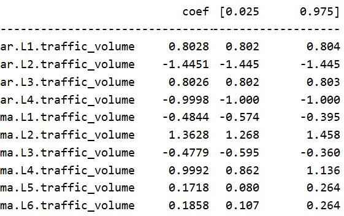

We notice there are no zeros in the confidence interval band. Thus, no simplification needed.  
We will also simplify model based on zero/pole cancellation by checking the roots of numerator and denominator. The roots of the AR and MA process are:

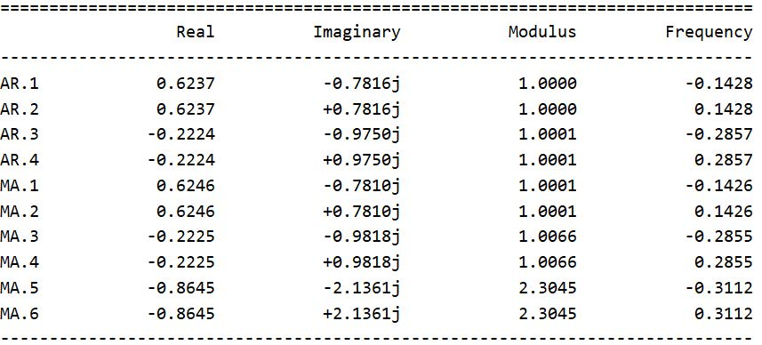
 
None of the roots are same, thus no zero/pole cancellation required. Hence the final ARMA model after simplification is ARMA(4,6).

### Performance Measures:

Plot of Prediction: The plot of forecasted values with the actual value is shown below: 

 
  
ACF of residual: The ACF of residuals for ARMA(4,6) is,

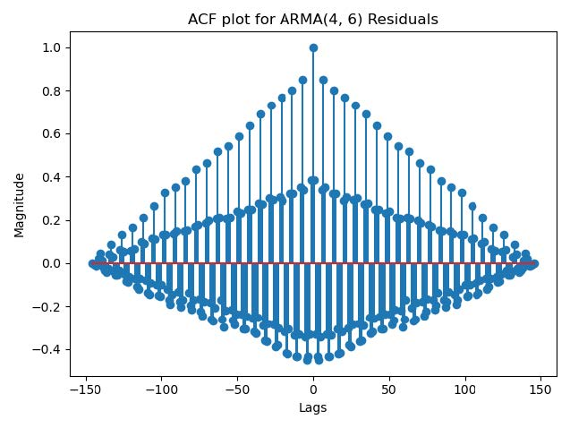
 
 
We conclude that the ACF plot does not resemble white noise.
  
A possible reason for poor performance of ARMA model is that our data contains seasonality.

  
The performance measures for the ARMA model are as follows:

<table>
<tr>
<th>RMSE</th>
<th>MSE</th>
<th>Residual Variance</th>
<th>Residual Mean</th>
</tr>
<tr>
<td>919.591</td>
<td>845648.87</td>
<td>842603.408</td>
<td>55.185</td>
</tr>
</table>
  

Biased or Unbiased models: Since the absolute value of mean of the residuals is greater than 0.05, we say that the model is biased. We can remove the bias by adding the mean to all the predictions. 
 

Variance of error of estimated parameters:
Estimated variance of error for na = 4 and nb = 6 is 119649.321

## 11. Final Model Selection

In our analysis for predicting traffic volume we have used the Average Method, Naïve Method, Drift Method, Holt Winter Model, Multiple Linear Regression model and the ARMA model. We will now compare the outputs of these models and provide conclusions. 

|Model|MSE|RMSE|Residual Mean|Residual Variance|
|------|-----|-----|------|--------|
|Holt Winter Model|84690.827|291.016884|-22.209225|84197.577336|
|Multiple Linear Regression Model|256424.508|506.383756|-35.470217|255166.372084|
|Average Model|282937.565|531.918758|55.477248|279859.840159|
|ARMA(4, 6) Model|845648.870|919.591687|55.185695|842603.408654|
|Naive Model|1191763.077|1091.679017|954.936248|279859.840159|
|Drift Model|1497497.754|1223.722907|1101.430227|284349.208489|

 

When we consider RMSE to be performance metric, we conclude that Holt Winter has the smallest RMSE and thus performs the best.
<b>Hence for traffic volume prediction problem the Holt Winter model is the best model.</b>

  
The plots for predicted and the actual values for all models are shown:

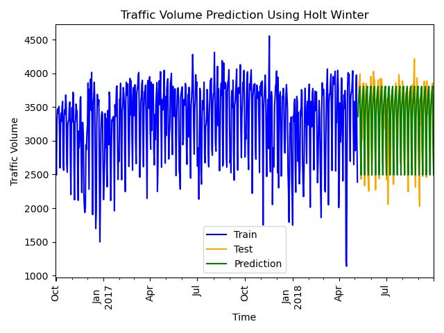
 

 

 

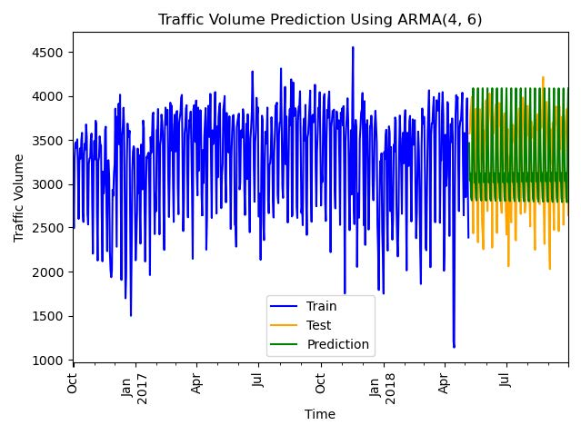
 

 

 

## 12. Conclusion

In conclusion based on the RMSE values, the Holt Winters model is recommended for traffic volume prediction. For future scope we may want to explore other models like SARIMA or recurrent neural networks.

## References

1. Link to all code files: https://github.com/sheldonsebastian/Traffic_Prediction_Using_Time_Series
 

