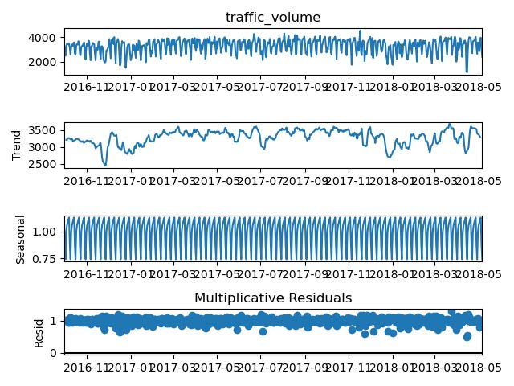

# Traffic Volume Prediction

Sheldon Sebastian

Photo by <a href="https://unsplash.com/@5tep5?utm_source=unsplash&utm_medium=referral&utm_content=creditCopyText">Alexander Popov</a> on <a href="https://unsplash.com/s/photos/traffic?utm_source=unsplash&utm_medium=referral&utm_content=creditCopyText">Unsplash</a>

  

## Abstract

 
We are predicting the traffic volume per day for the I94 interstate. The traffic volume per day is the number of cars which use the I94 interstate between St. Paul and Minneapolis. To make accurate forecasts, 6 models Average Model, Naïve Model, Drift Model, Holt Winter Model, Multiple linear regression and ARMA were used. The performance of the all models are compared and the best performing model is recommended to forecast traffic volume.
 
 
<i>Keywords:</i> Forecasting, Traffic, Average model, Naïve model, Drift Model, Holt Winter, ARMA, Linear Regression

## Table of contents

1. Introduction
2. Data description and preprocessing
3. Stationarity check
4. Average Model
5. Naive Model
6. Drift Model
7. Time series decomposition
8. Holt Winters method
9. Multiple Linear Regression
10. ARMA model
11. Best Model
12. Conclusion

## 1. Introduction

We are predicting the number of cars in a day on the I94 interstate between St. Paul and Minneapolis as shown in the below figure:

 

Business value of project:
 
<ol>
<li>Avoid Traffic Congestion: We can predict the days when there will be heavy traffic congestion and thus take contingencies to avoid them.</li>
<li>Road Maintenance: Using the traffic volume predictions we can estimate how long before the road needs repairs and we can schedule repairs when there is least traffic volume.</li>
</ol>
For achieving the goal of predicting traffic volume, we are considering 6 prediction models: Average, Naïve, Drift, Holt Winter, ARMA model and Multiple Linear Regression model.  
In average model, all the future predictions are average of the training data. In naïve model, we predict all the future values by taking the last value of the training dataset. In drift model, we plot a line from the first point of the data to the last point and extend it to predict all the future values. In the Holt Winter method, we will find whether traffic volume follows additive or multiplicative trend and then make predictions.
For the Linear Regression Model, we will scale the feature variables and perform data cleaning and then make predictions. Finally, for ARMA model, we will estimate the order of the ARMA process using GPAC table, estimate the parameters for ARMA and check whether the residuals pass the chi square test or not.  
Once all the models are created, we will compare the performance and recommend the best performing model.

## 2. Data description and preprocessing

The dataset has hourly traffic volume from October 2012 to September 2018. Traffic volume is defined as count of cars in an hour on the interstate. As described previously, the hourly traffic volume is tracked between Minneapolis and St Paul, MN.

  
The dataset is sourced from the following website: 
https://archive.ics.uci.edu/ml/datasets/Metro+Interstate+Traffic+Volume

 
<b>Resampling strategy</b>
 

For computational purposes and model interpretability the hourly data was resampled into daily data. Also, we are focusing on traffic volume data for September 2016 to September 2018.

When we perform resampling the following functions were applied to the variables:
<ul>
<li>Mean: temp, clouds_all, traffic_volume, rain_1h, snow_1h.</li>
<li>First: weather_main, holiday.</li>
</ul>

After resampling the shape of the dataset is <b>(731,7)</b>.

 
<b>Summary Statistics</b>
 

The summary statistics for numeric columns are as follows: 

We notice that the snow_1h column has all values as zero, thus we remove that column.
  
The summary statistics for categorical columns are as follows: 

We notice that the holiday column has 22 values only, thus we replace all the other NaN values with “No Holiday” values. After replacing all the holiday NaN columns with 'No Holiday' value we get value counts for holiday column as:
 

 
We also notice that the weather_main column contains 9 unique values which are:
 

 
We condense this information as follows:
<ul>
<li>Rain additionally covers the values Drizzle, Thunderstorm</li>
<li>Fog additionally covers the values Mist, Haze, Smoke</li>
</ul>
 
Thus, after condensing the value counts are as follows:
 

 
Finally, after resampling and data cleaning the column count with NaN values are:
 

 
Hence, we do not need to perform any data imputation.

 
<b>Traffic Volume over time</b>
 

We plot the traffic volume over time, the traffic volume data is resampled to daily data and the scope of data is from 09/2016 to 09/2018.

 
<b>ACF of traffic volume</b>
 

For plotting the ACF plot we have set the value of lag = 200.

 
We notice that the ACF values show decay at lag = 200.

 
<b>Train-Test Split</b>
 

We split the resampled data into train and test datasets. The dimension for train dataset is <b>(584,6)</b>. The dimension for test dataset is <b>(147,6)</b>

## 3. Stationarity check

To check if traffic volume is stationary or not, we perform the ADF test.
 

 
From ADF test we conclude that traffic volume is stationary.

## 4. Average Model

We compute the mean of training data and perform h step predictions to match the size of the test data.

 
The model statistics are as follows: 
<table>
<tr>
<th>RMSE</th>
<th>MSE</th>
<th>Residual Variance</th>
<th>Residual Mean</th>
</tr>
<tr>
<td>531.918</td>
<td>282937.565</td>
<td>279859.840</td>
<td>55.477</td>
</tr>
</table>

 
The plot of forecasted values with the actual value is shown below:

  
The ACF of residuals is as follows:

 
We conclude that the ACF plot does not resemble white noise.

## 5. Naive Model

We find the last sample of training data and perform h step predictions to match the size of the test data.

 
The model statistics are as follows: 
<table>
<tr>
<th>RMSE</th>
<th>MSE</th>
<th>Residual Variance</th>
<th>Residual Mean</th>
</tr>
<tr>
<td>1091.679</td>
<td>1191763.077</td>
<td>279859.840</td>
<td>954.936</td>
</tr>
</table>

 
The plot of forecasted values with the actual value is shown below:

  
The ACF of residuals is as follows:

 
We conclude that the ACF plot does not resemble white noise.

## 6. Drift Model

The performance measures for the Drift Model are as follows:

<table>
<tr>
<th>RMSE</th>
<th>MSE</th>
<th>Residual Variance</th>
<th>Residual Mean</th>
</tr>
<tr>
<td>1223.722</td>
<td>1497497.754</td>
<td>284349.208</td>
<td>1101.430</td>
</tr>
</table>

 
The plot of forecasted values with the actual value is shown below:

  
The ACF of residuals is as follows:

 
We conclude that the ACF plot does not resemble white noise.

## 7. Time series decomposition

We will decompose traffic volume to comprehend whether trend and seasonality are additive or multiplicative. 
The Multiplicative time series decomposition plot is shown below:

 The Additive time series decomposition plot is shown below: 

We notice that the additive residuals have high variance and it ranges from +1000 to -1000, whereas all the multiplicative residuals are close to one.  
Thus, the multiplicative decomposition best represents the traffic volume data and we see a strong seasonality component but there is no trend visible.

## 8. Holt Winters method

Based on the time series decomposition we will configure the Holt-Winters parameters for predicting the test data. We will set the seasonality to be multiplicative and set trend to be None.

The performance measures for the Holt Winters Model are as follows:

<table>
<tr>
<th>RMSE</th>
<th>MSE</th>
<th>Residual Variance</th>
<th>Residual Mean</th>
</tr>
<tr>
<td>84690.827</td>
<td>291.017</td>
<td>84197.577</td>
<td>-22.209</td>
</tr>
</table>
 
The plot for Holt Winter model prediction along with actual predictions is shown below:
 

 
We notice from above plot that the Holt Winter model predictions are close to the actual values.
  
ACF of residuals: We notice that the ACF plot for Holt Winter method resembles the white noise.

## 9. Multiple Linear Regression

## 10. ARMA model

## 11. Best Model

## 12. Conclusion

## References

1. Link to all code files: https://github.com/sheldonsebastian/Traffic_Prediction_Using_Time_Series
 

